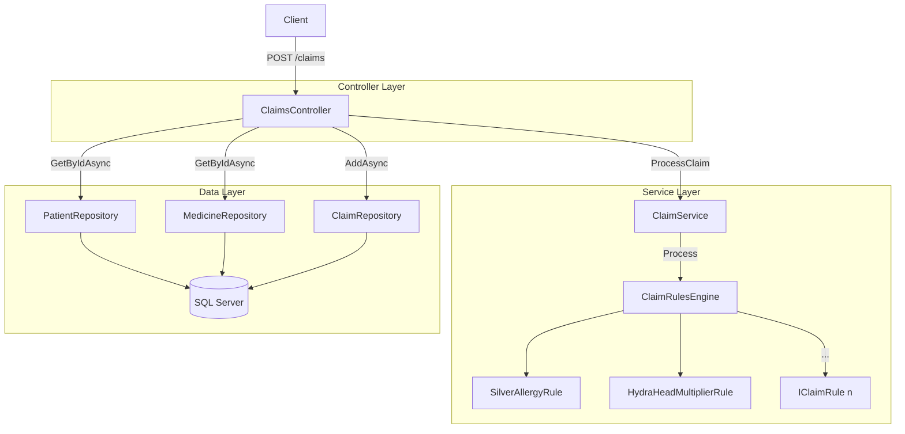

# CryptidCare

A pharmacy claims processing API for mythical beings (Werewolves, Hydras, Phoenixes, etc.).  
Built as a demonstration of clean architecture, TDD, and extensible rules design in .NET 10.

---

## Architecture Overview



---

## Patterns & Decisions

### Thin Controller
`ClaimsController` is responsible only for HTTP concerns: deserializing the request, delegating to the service layer, and returning an `ActionResult`. It has no business logic.

### Service Layer
`ClaimService` owns the business logic entry point. It accepts rich domain objects (`Patient`, `Medicine`, quantity), runs them through the rules engine, and returns a `ClaimResponse`. It has no knowledge of HTTP or persistence.

### Rules Engine (Chain of Responsibility)
Business rules are modeled as ordered, independently registered `IClaimRule` implementations. `ClaimRulesEngine` iterates them in registration order and short-circuits on the first rejection. Adding a new rule requires only:
1. Implementing `IClaimRule`
2. Registering it in `Program.cs`

No existing code changes. Rules are resolved via `IEnumerable<IClaimRule>` from the DI container, so order is controlled by registration order.

**Current rules:**
| Rule | Condition | Effect |
|---|---|---|
| `SilverAllergyRule` | Patient is Werewolf + medicine contains silver | Reject claim |
| `HydraHeadMultiplierRule` | Patient is Hydra | Multiply dispensed quantity by head count |

### Repository Pattern
Data access is abstracted behind `IPatientRepository`, `IMedicineRepository`, and `IClaimRepository`. The controller depends only on these interfaces — it has no knowledge of Entity Framework or SQL. This allows the ORM to be swapped or mocked independently of business logic.

### Mutable Pipeline Context
`ClaimContext` is an intentionally mutable object passed through the rules pipeline. Rules may set `DispensedQuantity` or call `Reject(reason)`. This avoids allocating new objects per rule and keeps rule implementations simple. If no rule sets `DispensedQuantity`, the service defaults it to `RequestedQuantity` (for non-rejected claims).

### Enum Serialization
`ClaimStatus` serializes as `"Approved"` / `"Rejected"` (strings), not integers. Configured globally via `JsonStringEnumConverter`. This makes API responses self-describing and resilient to enum reordering.

---

## Project Structure

```
CryptidCare/
├── Controllers/
│   └── ClaimsController.cs       # HTTP layer only
├── Data/
│   ├── CryptidCareDbContext.cs   # EF Core context
│   └── Repositories/             # IFoo + Foo implementations
├── Database/
│   ├── schema.sql                # Table definitions
│   └── seed.sql                  # Sample mythical patients & medicines
├── Models/                       # Domain types (Patient, Medicine, Claim, etc.)
├── Services/
│   ├── IClaimService.cs
│   ├── ClaimService.cs           # Owns rules engine; core logic entry point
│   └── Rules/
│       ├── IClaimRule.cs
│       ├── ClaimRulesEngine.cs
│       ├── SilverAllergyRule.cs
│       └── HydraHeadMultiplierRule.cs
├── docker-compose.yml            # SQL Server 2022 container
└── CryptidCare.Tests/
    └── ClaimsControllerTests.cs  # xUnit; SQLite in-memory; DI-resolved controller
```

---

## Running Locally

**Prerequisites:** .NET 10 SDK, SQL Server Express (`.\SQLEXPRESS`)

```bash
# Apply schema and seed data
sqlcmd -S .\SQLEXPRESS -i Database/schema.sql
sqlcmd -S .\SQLEXPRESS -i Database/seed.sql

# Run API
dotnet run --project CryptidCare.csproj

# Run tests
dotnet test CryptidCare.Tests/CryptidCare.Tests.csproj
```

## Running with Docker

```bash
docker compose up -d
# Update appsettings.Development.json connection string to Docker (see docker-compose.yml)
dotnet run --project CryptidCare.csproj
```

> **Note:** Docker requires virtualization (VT-x / AMD-V) enabled in BIOS and WSL2 installed.
